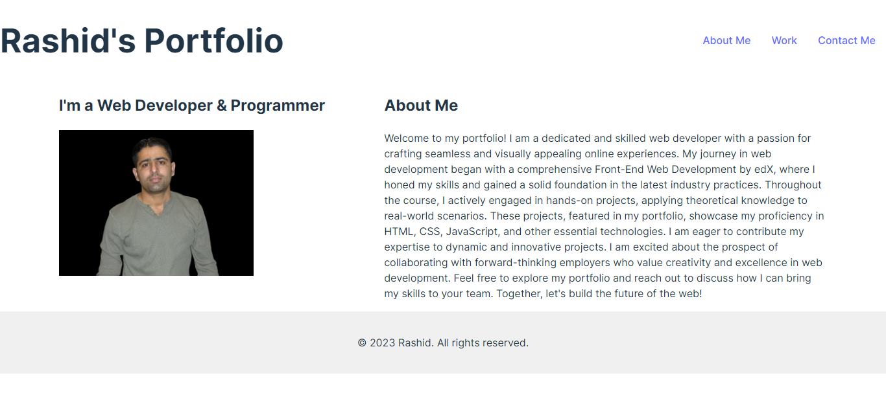
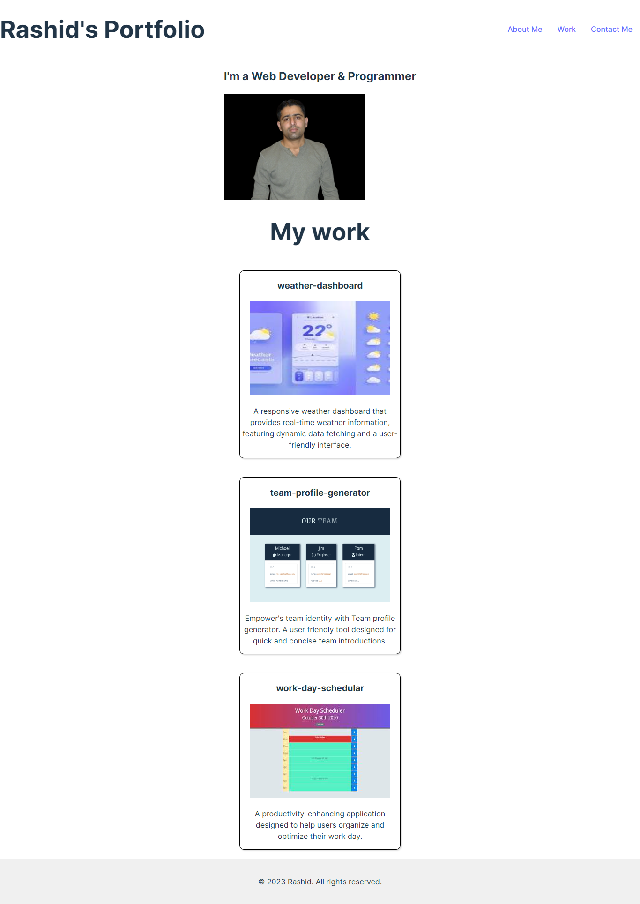
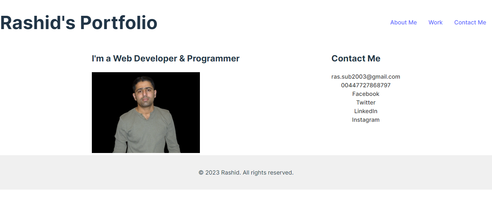

## Rashid's Portfolio
As a dedicated web developer, I showcase my commitment to innovation and functionality through a collection of dynamic projects.
//===============================================
## Screenshots

# Links for Github & Live:
https://github.com/rashid-subhani/rashid-portfolio

https://rashid-subhani.github.io/rashid-portfolio/

# About Me
Greetings! I'm Rashid Subhani, a passionate web developer committed to creating engaging and user-centric online experiences. My journey in web development began with a comprehensive Front-End Web Development bootcamp on Edx, where I acquired a strong foundation in HTML, CSS, and JavaScript.

# Key Highlights:
Successfully completed the Edx bootcamp in Front-End Web Development.
Demonstrated skills in creating responsive and visually appealing websites.
Proven ability to translate design concepts into functional and intuitive user interfaces. Adept at collaborating with cross-functional teams to deliver high-quality projects.
# Work
Project Highlights:
# Project Name 1: Weather-dashboard

Description: A responsive weather dashboard that provides real-time weather information, featuring dynamic data fetching and a user-friendly interface.
link: "https://github.com/rashid-subhani/weather-dashboard"

# Project Name 2: Team-profile-generator
Description: Empower's team identity with Team profile generator. A user friendly tool designed for quick and concise team introductions.
link: "https://github.com/rashid-subhani/team--profile-generator"

# Project Name 3: Work-day-schedular
Description: A productivity-enhancing application designed to help users organize and optimize their work day.
link: "https://github.com/rashid-subhani/work-day-schedular"

Feel free to explore my repository to discover more about my skills and capabilities!

# Contact Me
I am always open to new opportunities and collaborations. If you're interested in working together or have any inquiries, please feel free to reach out to me.

Email: [ras.sub2003@gmail.com]
LinkedIn: [[Your LinkedIn Profile](https://github.com/rashid-subhani)]

Let's connect and create something amazing together!